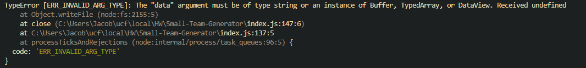
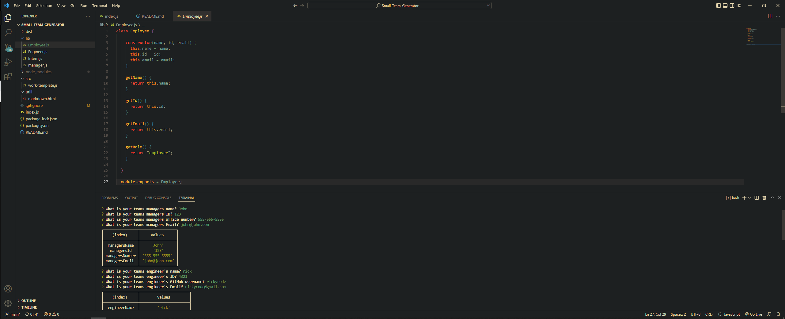

# Small Team Generator

## Description

This is a program designed to help organize a small team of employees.  This program uses Inquierer to ask questions in the terminal, which will be turned into data to be displayed on an HTML page.  Most of the code is set up to create the HTML page, however I was running into a specific issue related to the array I use to store the employees.  I am currently in the proccess of troubleshooting this issue, and will update the project once successful.

## Installation

Pull down the repo to your local computer.  Once successfully pulled down, open the integrated console.  Once opened type "npm i" to install all the necessary node dependencies.  Once instaleed, type "node index.js" to launch the program.  Then simply follow the on screen instructions.

## Usage

[Here is a link](https://youtu.be/cxETb-Rk-ek) to a video walkthrough of the team generator.  The app will ask you questions about the your team.  Simply enter the information asked and press enter to proceed to the next question.  The questions are split into three types of employees, first a Manager, second an Engineer, and last a Intern.  All three will share some questions, but each employee will have a specific question related to their position; for instance the Intern will be asked for their school attended.

## Credits

Huge thanks to my classmates and teaching staff for their support on this project!
